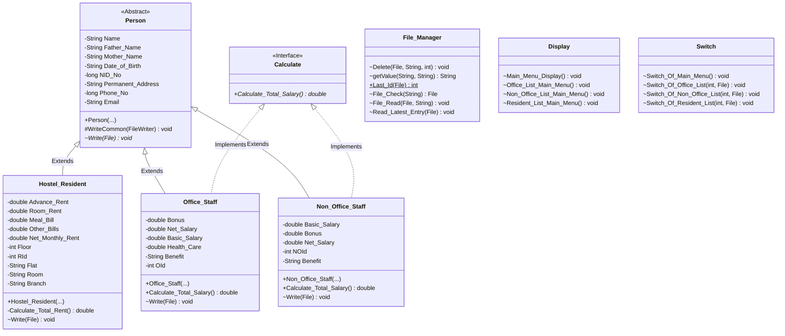

# 🏢 Hostel Management System

[](https://www.oracle.com/java/)
[](https://maven.apache.org/)
[](https://netbeans.apache.org/)
[](#license)

A modular, console-based **Hostel Management System** developed in Java. The application enables hostel administrators to manage records for hostel residents, office staff, and non-office staff with persistent flat-file storage, automated ID generation, financial calculations, and interactive menu-driven workflows.

---

## 📌 Table of Contents

- [Features](#-features)
- [OOP Architecture & Design](#-oop-architecture--design)
- [Project Structure](#-project-structure)
- [File Persistence & Storage](#-file-persistence--storage)
- [Prerequisites](#-prerequisites)
- [Getting Started](#-getting-started)
  - [Option 1: Using Apache Maven (Command Line)](#option-1-using-apache-maven-command-line)
  - [Option 2: Using Apache NetBeans / IDE](#option-2-using-apache-netbeans--ide)
  - [Option 3: Standard Java Compilation](#option-3-standard-java-compilation)
- [Usage & Menu Navigation](#-usage--menu-navigation)
- [Sample Data Format](#-sample-data-format)
- [Author](#-author)

---

## ✨ Features

### 1. 🛏️ Hostel Resident Management
- **Add New Residents:** Capture personal data (Name, Parents' Names, DOB, NID, Address, Phone, Email) along with room allocation details (Floor, Flat, Room, Branch).
- **Automated Billing Calculations:** Computes net monthly rent dynamically (`Room Rent + Meal Bill + Other Bills`) in addition to tracking advance rent payments.
- **Update Records:** Granular, field-by-field updates for personal or billing information.
- **Remove Residents:** Safe record deletion with automated file re-indexing.
- **Unique Resident IDs:** Automatically generates sequential IDs prefixed with `R` (e.g., `R1`, `R2`, ...).

### 2. 💼 Office Staff Management
- **Employee Profiling:** Store personal records and employee compensation details.
- **Salary Computation:** Automatically computes total net salary (`Basic Salary + Bonus + Health Care`).
- **Standard Benefits:** Pre-configured executive benefits package (*Flat, Car, Insurance*).
- **Manage Records:** Add, update individual fields, view, and delete staff by ID (`O1`, `O2`, ...).

### 3. 🧹 Non-Office Staff Management
- **Staff Records:** Manage operational staff details.
- **Net Salary Computation:** Computes net salary (`Basic Salary + Bonus`).
- **Staff Perks:** Pre-assigned benefits (*Hostel Seat, 3 Meals*).
- **Record Operations:** Complete CRUD operations with unique IDs (`NO1`, `NO2`, ...).

### 4. 💾 Robust File Management (`File_Manager`)
- **Persistent Text-Based Database:** Data is persisted to text files (`Resident List.txt`, `Office Staff List.txt`, `Non Office Staff List.txt`).
- **Auto-Initialization:** Automatically creates required data files if missing.
- **Safe Atomicity for Edits/Deletes:** Uses temporary staging files and atomic rename operations to prevent data corruption.
- **Real-Time Feed:** Displays the latest added entry immediately upon record submission.

---

## 🏛️ OOP Architecture & Design

The project demonstrates core **Object-Oriented Programming (OOP)** principles:



### Key Design Highlights
- **Abstraction:** The abstract `Person` class encapsulates shared attributes and common I/O methods.
- **Inheritance:** `Hostel_Resident`, `Office_Staff`, and `Non_Office_Staff` extend `Person` and reuse core personal attributes.
- **Polymorphism & Interfaces:** The `Calculate` interface standardizes salary computations across distinct staff types.
- **Encapsulation:** Class variables are strictly protected with scoped access and getters/setters/constructors.
- **Separation of Concerns:**
  - `Hostel_Management_System`: Application bootstrap and error boundary.
  - `Display`: UI views and menus.
  - `Switch`: Controller logic and input handling.
  - `File_Manager`: Data persistence and file-handling utilities.

---

## 📁 Project Structure

```text
Hostel_Management_System/
│
├── pom.xml                             # Maven configuration and build dependencies
├── Resident List.txt                   # Persistent storage for residents
├── Office Staff List.txt               # Persistent storage for office staff
├── Non Office Staff List.txt           # Persistent storage for non-office staff
│
└── src/
    └── main/
        └── java/
            └── hostel_management_system/
                ├── Hostel_Management_System.java  # Main application entry point
                ├── Person.java                    # Abstract base entity & Calculate interface
                ├── Hostel_Resident.java           # Resident domain model & calculations
                ├── Office_Staff.java              # Office staff domain model
                ├── Non_Office_Staff.java          # Non-office staff domain model
                ├── File_Manager.java              # File I/O, parsing & persistence logic
                ├── Display.java                   # Terminal UI and display menus
                └── Switch.java                    # Menu routing and action handling
```

---

## 🗄️ File Persistence & Storage

Records are serialized into structured delimiter-separated blocks (`----------------------`) inside local `.txt` files.

### Example Resident Record (`Resident List.txt`):
```text
ID: R1
Name: John Doe
Father's Name: Robert Doe
Mother's Name: Mary Doe
Date of Birth: 2001-05-15
NID No: 1234567890
Permanent Address: 123 Elm Street, Cityville
Phone No: 1234567890
Email: john.doe@example.com
Advance Rent: 5000.0
Room Rent: 8000.0
Meal Bill: 3000.0
Other Bills: 500.0
Floor: 3
Flat: 3B
Room: 302
Branch: North Wing
Net Monthly Rent: 11500.0
----------------------
```

---

## ⚙️ Prerequisites

- **Java Development Kit (JDK):** Version 17 or higher (configured for Java 21+ / 25).
- **Apache Maven:** 3.6.0+ (optional, if building via Maven CLI).
- **IDE (Optional):** Apache NetBeans, IntelliJ IDEA, Eclipse, or Visual Studio Code.

---

## 🚀 Getting Started

### Option 1: Using Apache Maven (Command Line)

1. **Clone the repository:**
   ```bash
   git clone https://github.com/your-username/Hostel_Management_System.git
   cd Hostel_Management_System
   ```

2. **Compile the project:**
   ```bash
   mvn clean compile
   ```

3. **Run the application:**
   ```bash
   mvn exec:java
   ```

---

### Option 2: Using Apache NetBeans / IDE

1. Open **Apache NetBeans**.
2. Go to `File` > `Open Project...`.
3. Select the `Hostel_Management_System` folder containing `pom.xml`.
4. Click **Run Project** (or press `F6`).

---

### Option 3: Standard Java Compilation

If running without Maven:

```bash
# Navigate to the project root
cd Hostel_Management_System

# Compile source files into target directory
javac -d ./bin src/main/java/hostel_management_system/*.java

# Execute the application
java -cp ./bin hostel_management_system.Hostel_Management_System
```

---

## 🖥️ Usage & Menu Navigation

When you run the application, the interactive main menu will appear:

```text
----------------------------
|                          |
| Hostel Management System |
|                          |
-----------Lists------------
|1.Office Staff            |
|2.Non-Office Staff        |
|3.Hostel Resident         |
|0.Exit                    |
----------------------------
Enter:
```

### Sub-menu Options:
Selecting any category (`1`, `2`, or `3`) brings up its dedicated management menu:
- `1` — **Add Record:** Prompts for personal and financial details, automatically assigning an incremental ID.
- `2` — **Update Record:** Search by ID and choose the specific field you wish to modify.
- `3` — **Remove Record:** Delete a record permanently by ID.
- `4` — **Return to Main Menu:** Navigates back to the root menu.

---

## 👨‍💻 Author

- **Name:** Md Fuad Anan
- **Student ID:** 251014032
- **GitHub:** [@mdfuadanan](https://github.com/mdfuadanan)

---

## 📄 License

This project is open source and available under the [MIT License](LICENSE).
